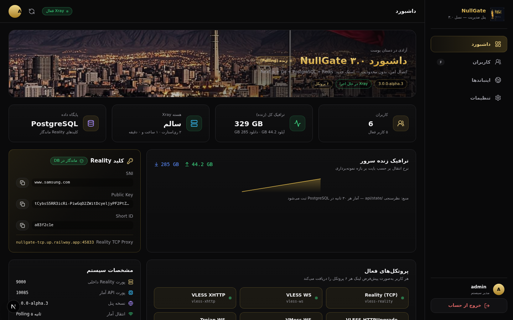
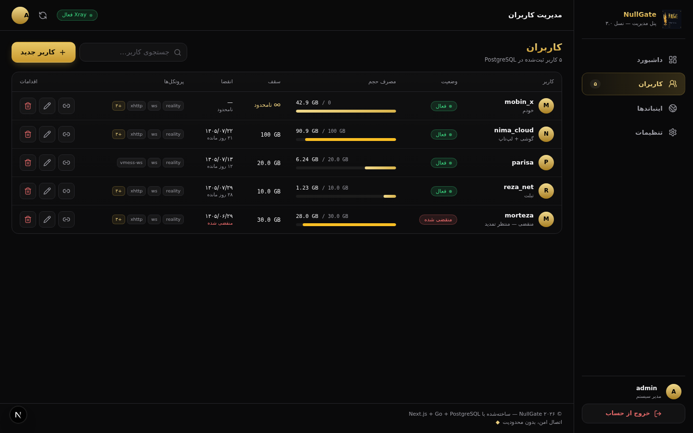
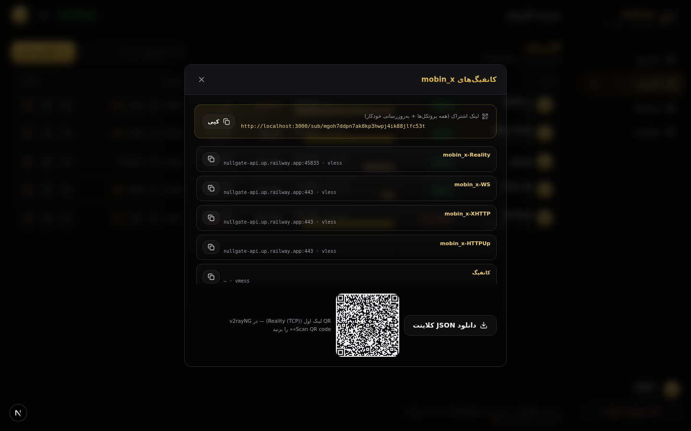
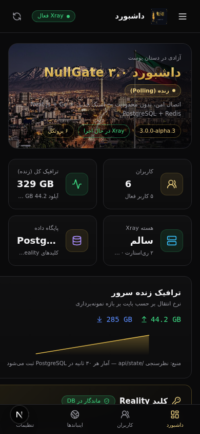

<div align="center">


# ⚡ NullGate 3.0

**پنل مدیریت پروکسی شخصی — نسل سوم**

*اتصال امن، بدون محدودیت — ایران، همیشه متصل*

[](https://go.dev)
[](https://github.com/XTLS/Xray-core)
[](https://nextjs.org)
[](https://postgresql.org)
[](https://redis.io)
[](https://railway.app)

**یک سرویس، همه‌چیز:** پنل وب + API + ساب‌اسکریپشن + موتور Xray در یک کانتینر — UI داخل باینری Go جاسازی شده (go:embed) و هیچ وابستگی خارجی برای سرو کردن صفحه‌ها وجود ندارد.

</div>

---

## ✨ ویژگی‌ها

| | |
|---|---|
| 🛡 **Reality + Vision** | دور زدن SNI-block با فاصله‌گیری از سایت‌های واقعی (SNI پیش‌فرض: `www.samsung.com`) |
| 🚄 **XHTTP / WS / HTTPUpgrade** | عبور از CDN و لبه‌های HTTP — همه روی همان دامنه پنل |
| 📊 **آمار زنده** | ترافیک لحظه‌ای از statsAPI خود Xray + WebSocket، ذخیره دوره‌ای در PostgreSQL |
| 🧾 **ساب‌اسکریپشن هوشمند** | لینک‌های آماده per-user با کوئری‌های رمزشده (HMAC) |
| 👥 **مدیریت کاربر** | سهمیه حجم، انقضا، انتخاب پروتکل per-user، نوت اختصاصی |
| 🎛 **اینباند سفارشی** | VLESS/VMess/Trojan × ws/xhttp/grpc/httpupgrade × TLS/Reality از داخل پنل |
| 🔑 **Reality ماندگار** | کلیدها در دیتابیس‌اند — Redeploy هرگز کلاینت‌ها را نمی‌شکند |
| 🌐 **فارسی RTL** | رابط مشکی-طلایی با فونت وزیرمتن، ریسپانسیو کامل |
| ⚡ **تیون سرعت** | بافر ۴MB اتصال، TCP_NODELAY + FastOpen + KeepAlive روی همه‌ی اینباندها |
| 🔀 **h2c داخلی** | HTTP/2 شفاف برای gRPC و کلاینت‌های h2 |

## 📸 نگاهی به پنل

| دشبورد | کاربران |
|---|---|
|  |  |
| **لینک‌های اشتراک** | **موبایل** |
|  |  |

## 🚀 استقرار روی Railway (رایگان — فقط یک سرویس)

> نیازمندی‌ها: یک ریپوی GitHub از این پروژه + اکانت Railway

<div align="center">

[](https://railway.app/new)

</div>

1. **پروژه جدید** ← Empty Project
2. سرویس‌های `postgres` و `redis` را از **Database** اضافه کنید (دقیقاً با همین نام‌ها)
3. سرویس **api** را از ریپوی GitHub بسازید — Root Directory = `/` (ریشه)
4. متغیرهای سرویس api:

   | متغیر | مقدار |
   |---|---|
   | `PORT` | `8080` |
   | `DATABASE_URL` | `${{postgres.DATABASE_URL}}` |
   | `REDIS_URL` | `${{redis.REDIS_URL}}` |
   | `SECRET` | یک هگز ۳۲ بایتی تصادفی (`openssl rand -hex 32`) |
   | `REALITY_SNI` | `www.samsung.com` |
   | `TCP_HOST` / `TCP_PORT` | دامنه/پورت عمومی TCP Proxy |

5. یک **TCP Proxy** روی سرویس api بسازید که به پورت داخلی `9000` برود → مقدارش را در `TCP_HOST` / `TCP_PORT` بگذارید
6. **Generate Domain** (پورت `8080`) → پنل بالا می‌آید → اولین حساب مدیر را بسازید — تمام! 🎉

<details>
<summary><b>➕ اینباند Reality دوم (مثلاً Reality-gRPC) روی سرور شخصی (VPS)</b></summary>

> ⚠️ **روی Railway قابل انجام نیست** — Railway به هر سرویس فقط «یک» TCP Proxy اجازه می‌دهد. برای gRPC روی Railway از روش `REALITY_NET=grpc` در جدول پایین استفاده کنید.

اینباند سفارشی بسازید (مثلاً پورت داخلی `9001`)، بعد یک **TCP Proxy دوم** روی همان پورت داخلی بسازید و آدرس عمومی‌اش را در متغیرهای زیر بگذارید:

```
TCP2_HOST=<دامنه پروکسی دوم>     # مثل xxx.proxy.rlwy.net
TCP2_PORT=<پورت عمومی پروکسی دوم>
TCP2_APP_PORT=9001                # پورت داخلی که پروکسی دوم به آن می‌رود
```

لینک‌های همه کاربران خودکار با آدرس درست ساخته می‌شوند. تا وقتی TCP Proxy دوم ساخته نشده، پنل با برچسب هشدار نشان می‌دهد که اینباند از بیرون در دسترس نیست.

</details>

## 🔧 همه‌ی متغیرهای محیطی

| متغیر | پیش‌فرض | توضیح |
|---|---|---|
| `PORT` | `8080` | پورت HTTP پنل |
| `DATABASE_URL` | — | **اجباری** — اتصال PostgreSQL |
| `REDIS_URL` | — | اختیاری — بدون آن نشست‌ها در حافظه‌اند |
| `SECRET` | — | کلید HMAC توکن‌های ساب‌اسکریپشن |
| `REALITY_SNI` | `www.samsung.com` | SNI پیش‌فرض Reality |
| `SESSION_HOURS` | `24` | عمر نشست ادمین |
| `TCP_HOST` / `TCP_PORT` | — | آدرس عمومی TCP Proxy اصلی (Reality) |
| `REALITY_NET` | `tcp` | ترنسپورت Reality داخلی: `tcp` یا `grpc` — روی Railway برای gRPC مقدار `grpc` بگذارید (لینک‌ها خودکار gun می‌شوند) |
| `REALITY_GRPC_SERVICE` | `nullgate` | نام سرویس gRPC وقتی `REALITY_NET=grpc` است |
| `TCP2_HOST` / `TCP2_PORT` | — | آدرس عمومی TCP Proxy دوم (اینباندهای سفارشی) |
| `TCP2_APP_PORT` | `9001` | پورت داخلی مقصد TCP Proxy دوم |
| `WS_PATH` | `/ws` | مسیر VLESS-WS |
| `XHTTP_PATH` | `/xhttp` | مسیر VLESS-XHTTP |
| `HU_PATH` | `/hu` | مسیر HTTPUpgrade |
| `VMESS_PATH` | `/vmess` | مسیر VMess-WS |
| `TROJAN_PATH` | `/trojan` | مسیر Trojan-WS |
| `XRAY_BIN` | `./xray/xray` | مسیر باینری Xray |
| `XRAY_VERSION` | `v26.3.27` | نسخه‌ای که در بوت دانلود می‌شود |
| `XRAY_BUFFER` | `4096` | بافر هر اتصال (KB) — عامل اصلی سرعت |
| `XRAY_IDLE` | `600` | ثانیه‌ی بستن اتصال بی‌کار |
| `COLLECT_INTERVAL` | `30` | ثانیه‌ی جمع‌آوری آمار |
| `CORS_ORIGIN` | `*` | مبدأ مجاز CORS |
| `COOKIE_INSECURE` | — | فقط برای توسعه‌ی HTTP محلی = `1` |

## 🏗 معماری

```text
                        ┌──────────────────────────────────────┐
   مرورگر ادمین ────────▶│  api (یک کانتینر، یک باینری Go)       │
   کلاینت‌های proxy ─────▶│                                      │
                        │  ┌─ UI جاسازی‌شده (go:embed)          │
   Railway HTTP edge ───▶│  ├─ REST /api/* + WebSocket + /sub/  │──▶ PostgreSQL (حقیقت)
   (TLS + دامنه)         │  ├─ h2c proxy → اینباندهای محلی      │──▶ Redis (نشست)
                        │  │    :10001 ws :10002 xhttp ...     │
   TCP Proxy (خام) ─────▶│  └─ Xray-core                        │
                        │       :9000 Reality-Vision           │
                        └──────────────────────────────────────┘
```

- **UI** در زمان build با Next.js استاتیک اکسپورت می‌شود و داخل باینری جاسازی می‌شود → یک سرویس کافی است.
- **مسیرهای اینباندها** روی همان دامنه‌ی پنل سرو می‌شوند (پراکسی درون-پردازه‌ای، جایگزین nginx).
- **Reality** پورت خام خودش را می‌خواهد → TCP Proxy جداگانه.

## 📱 کلاینت‌های پیشنهادی

| پلتفرم | اپ |
|---|---|
| اندروید | [v2rayNG](https://github.com/2dust/v2rayNG) / [Hiddify](https://github.com/hiddify/hiddify-app) |
| iOS | [Streisand](https://apps.apple.com/app/streisand/id6492264100) / [V2Box](https://apps.apple.com/app/v2box/id6446822711) |
| ویندوز / مک / لینوکس | [v2rayN](https://github.com/2dust/v2rayN) / [Hiddify](https://github.com/hiddify/hiddify-app) |

ساب‌اسکریپشن را با لینک `/sub/<token>` در اپ وارد کنید — همه‌ی کانفیگ‌های مجاز آن کاربر یک‌جا می‌آیند.

## ❓ رفع اشکال

<details>
<summary><b>Reality پینگ نمی‌دهد</b></summary>

1. `TCP_HOST` / `TCP_PORT` دقیقاً با آدرس TCP Proxy یکی باشند
2. پروکسی واقعاً به پورت داخلی `9000` (متغیر `RAILWAY_TCP_APPLICATION_PORT`) برود
3. بعضی ISP ها پورت‌های غیر ۴۴۳ را مسیربندی نمی‌کنند — از داخل VPN دیگر تست بگیرید تا منبع مشکل پیدا شود
</details>

<details>
<summary><b>SNI پیش‌فرض چون <code>www.microsoft.com</code> نیست؟</b></summary>

چون مایکروسافت `X25519MLKEM768` (کی‌اکسچنج پست‌کوانتومی) را در TLS 1.3 اجباری کرده و Xray هنوز در handshake ی Reality با آن ناسازگار است — `www.samsung.com` تمیز جواب می‌دهد.
</details>

<details>
<summary><b>لینک gRPC ساخته شد ولی وصل نمی‌شود</b></summary>

اینباند‌های Reality سفارشی (از جمله gRPC) برای دسترسی از بیرون به TCP Proxy اختصاصی نیاز دارند — بخش «اینباند Reality دوم» بالا را ببینید. دربند TLS+gRPC روی دامنه هم فعال است (h2c) ولی به پشتیبانی HTTP/2 از سمت لبه‌ی پلتفرم وابسته است.
</details>

---

<div align="center">

**ساخته‌شده با ☕ و عشق برای اینترنت آزاد**

[RAILWAY_GUIDE](RAILWAY_GUIDE.md) · [README فنی](README-3.0.md)

</div>
